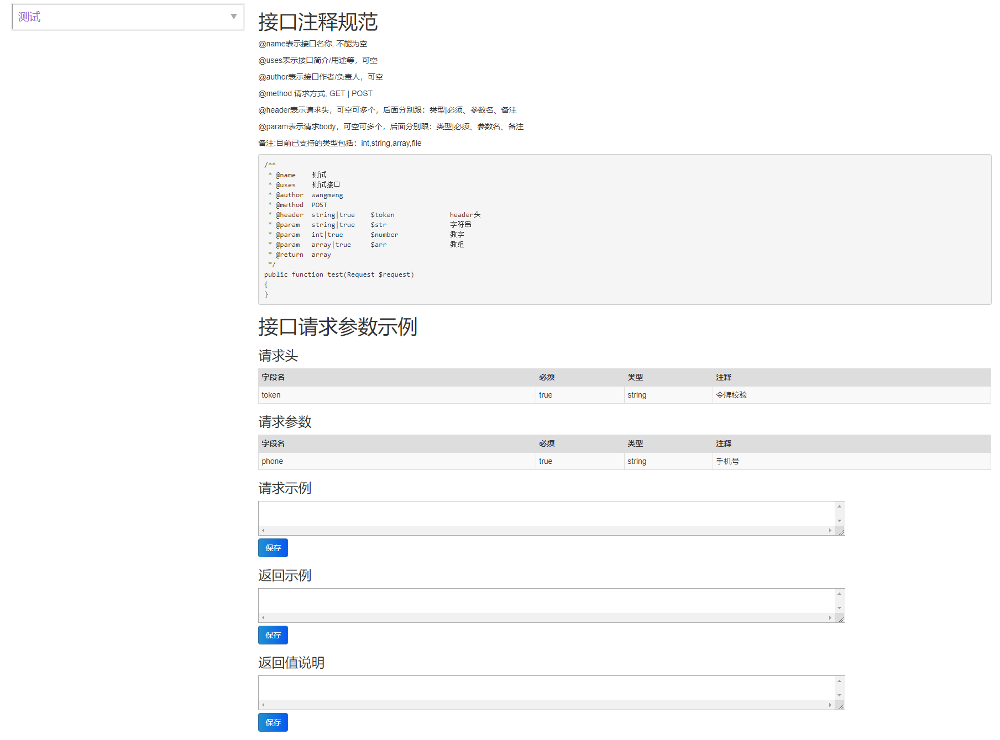
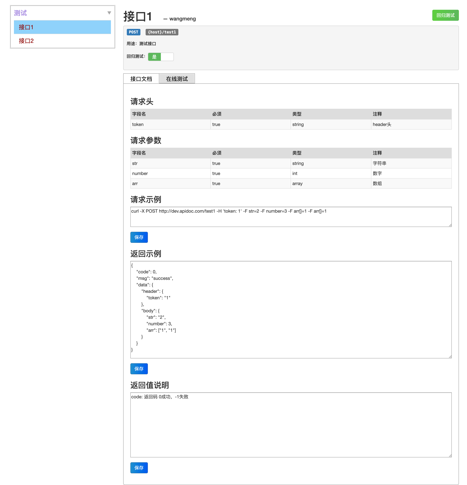
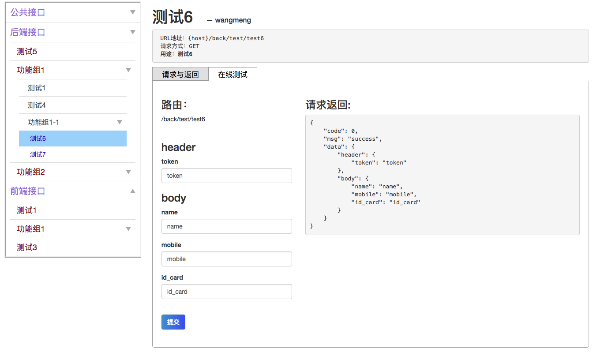

# 自动生成在线测试接口和文档

## 一.安装

### 1.在项目根目录下执行

```
composer require oyhdd/laravel-apidoc
```

### 2.发布资源文件及配置文件

```
php artisan vendor:publish --provider="Oyhdd\Document\DocumentServiceProvider"
```
注：若文件已存在，可通过以下命令强制覆盖

```
php artisan vendor:publish --provider="Oyhdd\Document\DocumentServiceProvider" --force
```

文件发布成功后，会生成配置文件config/document.php，前端资源文件resources/views/vendor/document/* 和 public/vendor/document/*

在浏览器打开{host}/document/api 后即可访问

## 二.使用方法
### 1.控制器接口函数中按如下格式进行函数注释：

```java
/**
 * @name    测试
 * @uses    测试
 * @author  wangmeng
 * @date    2017-08-07
 * @header  string|true           $token         令牌
 * @param   string|false          $name          姓名
 * @param   string|false          $mobile        手机号
 * @param   string|false          $id_card       身份证
 * @return  array
 */
public function test(Request $request)
{
}
```

### 2.在routes/api.php中按如下格式配置路由：

```java
//公共接口
Route::name('公共接口.')->group(function ($router) {
    $router->get('test/test', 'Back\TestController@test');
});

//后端接口
Route::name('后端接口.')->namespace('Back')->prefix('back')->group(function ($router) {

    $router->post('test/test5', 'TestController@test5');

    //功能组1
    $router->name('功能组1.')->group(function($router) {
        $router->get('test/test1', 'TestController@test1');
        $router->post('test/test4', 'TestController@test4');

        //功能组1.1
        $router->name('功能组1-1.')->group(function($router) {
            $router->get('test/test6', 'TestController@test6');
            $router->get('test/test7', 'TestController@test7');
        });
    });

    //功能组2
    $router->name('功能组2.')->group(function($router) {
        $router->post('test/test2', 'TestController@test2');
        $router->get('test/test3', 'TestController@test3');
    });
});

//前端接口
Route::name('前端接口.')->namespace('Front')->prefix('front')->group(function ($router) {

    $router->get('test/test1', 'TestController@test1');

    //功能组1
    $router->name('功能组1.')->group(function($router) {
        $router->get('test/test2', 'TestController@test2');
    });

    $router->get('test/test3', 'TestController@test3');

});
```

可通过name()和group()对路由接口进行菜单栏显示时分组，其中name()是对该组路由接口进行命名，若无name(),则该组下的接口都位于一级菜单中

注意：name()中字符串参数以“.”结尾，若要自定义字符，则config/document.php中的delimiter也要同步修改

### 3.config/document.php中可配置相关功能

```java
<?php

return [

    // 路由分组的分隔符
    'delimiter' => '.',

    // 不需展示的接口路由
    'hiddenMethods' => [
        // Controller::class
        'App\Http\Controllers\TestController' => [
            'test',//该Controller下的此action
            '*',//该Controller下的所有action
        ],
    ],

    // 是否显示未配置路由的接口
    'showUndefinedRouter' => false,

    // 各接口的header都自动同步为最新的header
    'syncHeader' => true,

];
```
各接口默认都会自动加载上次该接口填写过的参数（header和body）；若syncHeader = true，则所有接口都会自动加载最新的header

### 4.返回示例与返回值说明待开发

## 三.效果展示








