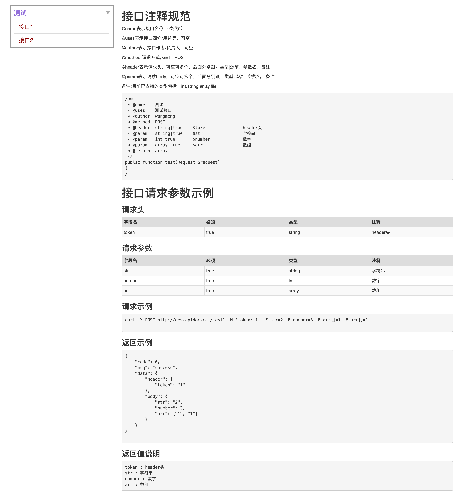
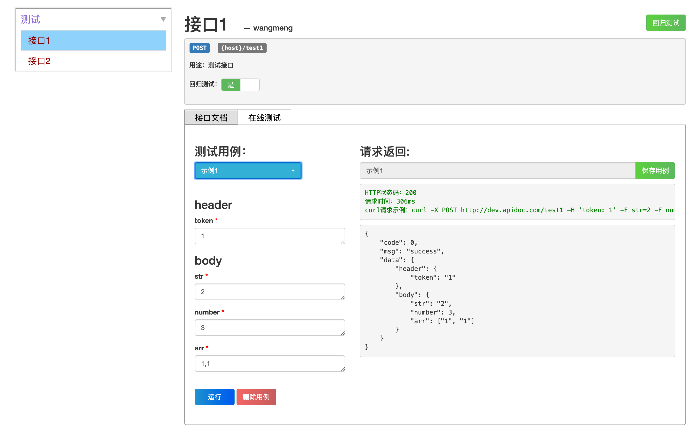

# 自动生成在线测试接口和文档

## 一.安装

### 1.在项目根目录下执行

```
composer require oyhdd/laravel-apidoc
```

### 2.发布资源文件及配置文件

```
php artisan vendor:publish --provider="Oyhdd\Document\DocumentServiceProvider"
```
注：若文件已存在，可通过以下命令强制覆盖

```
php artisan vendor:publish --provider="Oyhdd\Document\DocumentServiceProvider" --force
```

文件发布成功后，会生成配置文件config/document.php，前端资源文件resources/views/vendor/document/* 和 public/vendor/document/*

### 3.创建数据表
```
php artisan migrate --path=./vendor/oyhdd/laravel-apidoc/src/database/migrations/

```

备注：api_doc表存储接口相关信息，api_doc_params表存储接口的测试用例

### 4.访问
在浏览器打开{host}/document/api 后即可访问

## 二.使用方法
### 1.控制器接口函数中按如下格式进行函数注释：

```java
    /**
     * @name   测试1
     * @uses   测试接口
     * @author wangmeng
     * @date   2018-10-19
     * @header string|true               $token              header头
     * @param  string|true               $str                字符串
     * @param  int|true                  $number             数字
     * @param  array|true                $arr                数组
     * @return array
     */
    public function test(Request $request)
    {
        $ret = [
            'code' => 0,
            'msg' => 'success',
            'data' => [
                'header' => ['token' => $request->header('token')],
                'body' => $request->all(),
            ],
        ];

        return $ret;
    }
```

### 2.在routes/api.php中按如下格式配置路由：

```java
//测试示例接口
Route::group([], function ($router) {
    // 接口组
    $router->name('测试.')->group(function ($router) {
        $router->post('test', 'Oyhdd\Document\Controllers\TestController@test');
    });
});
```

可通过name()和group()对路由接口进行菜单栏显示时分组，其中name()是对该组路由接口进行命名，若无name(),则该组下的接口都位于一级菜单中

注意：name()中字符串参数以“.”结尾，若要自定义字符，则config/document.php中的delimiter也要同步修改

### 3.config/document.php中可配置相关功能

```java
<?php

return [

    // 路由分组的分隔符
    'delimiter' => '.',

    // 不需展示的接口路由
    'hiddenMethods' => [
        // Controller::class
        'App\Http\Controllers\TestController' => [
            'test',//该Controller下的此action
            '*',//该Controller下的所有action
        ],
    ],

    // 是否显示未配置路由的接口
    'showUndefinedRouter' => false,
];
```

### 4.接口文档
- apidoc会根据函数注释自动解析为接口文档
- 请求参数、请求示例、返回示例和返回值说明可以自行填写，数据保存在api_doc表中


### 5.在线测试
- 填写完相关参数后，可点击运行按钮进行接口测试，支持打印函数的输出，也支持dd(),dump()等函数


- 运行成功后，可点击"保存用例"按钮保存测试用例,然后在测试用例下拉框中可看到所有的测试用例，也可以选择想要的测试用例来运行

